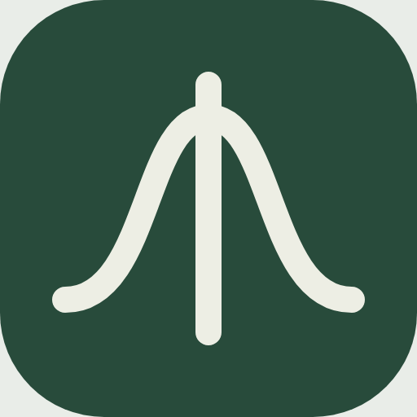

# GaussVM

**Liquidity shaped for prediction markets.**

Gaussian prediction-market liquidity on **1inch Aqua and SwapVM**. A custom SwapVM instruction prices collateral-backed YES/NO trades using the pm-AMM invariant. Aqua accounts for maker allocations and settles trades while the maker's outcome tokens stay in their wallet until execution.

**[Open the Sepolia app](https://krishna-aga.github.io/gaussvm/)** · [Deployed contracts](docs/live-deployment.md)

The demo market asks **Will this project win ETHOnline 2026?** Connect a wallet on Sepolia, get free faucet ETH for gas, then select **Get 100 YES + 100 NO** to trade. Market rules are shown beside the question. This is an unaudited test-token prototype with manual resolution; time-scaled pricing is experimental.

Powered by Aqua — © Degensoft Ltd 2025  
Powered by SwapVM — © Degensoft Ltd 2025

## Run locally

Requires **Node.js 22.16+**, npm and Git. No wallet extension, faucet or API key is needed locally.

```sh
git clone --recurse-submodules https://github.com/krishna-aga/gaussvm.git
cd gaussvm
npm ci
npm run dev
```

For an existing checkout, run `git submodule update --init --recursive` before starting. Source ZIPs omit the required submodules.

Open **http://127.0.0.1:5173**. The launcher compiles contracts, starts a local EVM, deploys Aqua and GaussVM, seeds 1,000 YES + 1,000 NO, and starts the app.

1. Select **Connect to swap**, then **Get 100 YES + 100 NO**.
2. Swap NO for YES or reverse direction. The market graph updates from chain balances and shows recent confirmed trades; the journal keeps transaction receipts.
3. Open **Liquidity** to create or dock positions, merge complete sets, and use the local maker controls for resolution and redemption.
4. Open **How it works** and select **Play walkthrough** to show example trades moving the pm-AMM price. **Explore the Gaussian curve** also has a time animation. These illustrations do not submit wallet transactions.

Ctrl+C stops services started by the launcher. To reset a resolved local market, run `npm run deploy:local` with the node running, then reload.

## Demos and checks

| Command | Purpose |
| --- | --- |
| `npm run demo` | Execute a swap against the running local demo; save receipts and balance changes to `reports/demo.json`. |
| `npm run demo:track` | Run a standalone lifecycle: two strategies sharing wallet inventory, three swaps, docking, merging and simulated redemption. Writes `reports/aqua-track.json`. |
| `npm run demo:fork` | Run that lifecycle against canonical Aqua on a local Ethereum fork. Writes `reports/aqua-track-fork.json`; all transactions stay on localhost. |
| `npm run check` | Compile Solidity, run core/gas/lifecycle checks, typecheck and build the app. |
| `npm run test:browser` | Exercise the local UI. Install Chromium first with `npx playwright install chromium`. |
| `npm run audit:math` | Run the bounded numerical audit and save results with source hashes. |

Browser tests resolve their local market. Reset it before a subsequent manual demo. See [verification](docs/verification.md) for recorded results and test coverage.

## How it works

- **BinaryMarket:** one gUSD splits into one YES plus one NO; complete sets can merge back into collateral. Manual resolution or timeout cancellation enables redemption.
- **GaussVM:** opcode `0x80` computes exact-input output with bounded Gaussian arithmetic and conservative bisection. Static and time-scaled strategies are supported.
- **SwapVM and Aqua:** pinned upstream contracts validate orders, enforce slippage/deadlines, and settle transfers. Allocations depend on maker balances and allowances.
- **Web app:** React/TypeScript interface with wallet connection, quotes, position controls, chain-derived price history and receipt recovery. Positions and the transaction journal are saved in the current browser; market history is read from the selected position's onchain swaps and balances. The interactive research examples are illustrative.

## Documentation

- [Aqua walkthrough](docs/aqua.md)
- [Mathematical specification](docs/math.md)
- [Market graph and interactive demo controls](docs/market-charts.md)
- [Architecture and encoding](docs/architecture.md)
- [Security assumptions and limits](docs/security.md)
- [Deployment and hosting](docs/deployment.md)
- [Troubleshooting and recovery](docs/troubleshooting.md)
- [Gas benchmarks and router migration](docs/gas-optimization.md)

Source lives in `contracts/`, `lib/`, `scripts/`, `web/` and `test/`. Pinned upstream contracts are Git submodules in `vendor/`; public chain manifests are in `deployments/`.

## Attribution and licensing

Built by **Krishna Agarwal** for ETHOnline 2026. The [pm-AMM research](https://www.paradigm.xyz/writing/pm-amm) is by **Ciamac Moallemi and Dan Robinson**. GaussVM contributes the bounded numerical implementation, SwapVM instruction and Aqua integration.

The project includes source-available Aqua/SwapVM code and is not MIT-only. See [LICENSE](LICENSE) and [third-party notices](THIRD_PARTY_NOTICES.md) for terms and pinned dependencies.
