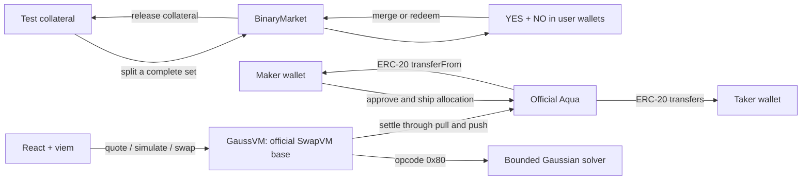

# Architecture

GaussVM is a single-maker Aqua position in complementary ERC-20 outcomes. It is not a central order book or pooled LP-share vault. Multiple makers can ship independent strategies; the UI operates on one selected strategy.



## Contracts

| Contract | Responsibility |
| --- | --- |
| `DemoCollateral` | 18-decimal faucet gUSD. Explicitly worthless test collateral. |
| `BinaryMarket` | Collateral-backed complete-set split/merge, manual resolution and public timeout cancellation. |
| `OutcomeToken` | Transferable ERC-20 YES/NO; only its market can mint or burn. |
| `GaussVM` | Extends the pinned official `SwapVM`; implements its current `_dispatch` interface. |
| `Gaussian` | Bounded normal CDF/PDF in signed 18-decimal fixed-point arithmetic. |
| `PmAmmMath` | Exact-input invariant solver with domain checks and conservative output. |
| Official `Aqua` | Unmodified upstream bytecode compiled from the pinned source; allocations and settlement. |

The router exposes one instruction rather than the entire upstream opcode catalog. It rejects multi-instruction programs, incorrect lengths, unsupported token pairs, exact-output requests and unavailable markets. This reduces composition assumptions for the demo. WETH is the zero address because the only permitted pair is the market's YES/NO pair; native payment/unwrapping paths are not supported. The SwapVM owner can rescue accidentally sent router assets using the inherited mechanism, not modify the pricing code.

## Encoding

The pinned SwapVM uses `Order(address maker, uint256 traits, bytes data)`. The data starts with two sorted 20-byte token addresses followed by the program. MakerTraits sets Aqua mode and four empty hook-slice endpoints at byte 40.

The Gaussian program is exactly 162 bytes:

```text
0x80 | 0xa0 | abi.encode(market, initialLiquidity, start, expiry, timeScaled)
  1      1                          160 bytes
```

`start` and `expiry` are ABI uint64; the liquidity scale is uint256. The scale and timestamps are immutable in that shipped order. `lib/encoding.mjs` is shared by scripts and browser. Integration tests compare its hash to `SwapVM.hash()` and execute actual orders using it.

The Aqua strategy hash is `keccak256(abi.encode(order))`. It is not an EIP-712 signature hash. `Aqua.ship(router, abi.encode(order), tokens, allocations)` authorizes the position. No token deposit occurs at ship time. A different time-scaled flag or start creates a different strategy hash.

Taker data carries exact-input, input-direction, transfer-in-first and Aqua-push flags. It encodes a minimum output and 120-second deadline in the UI. Wallet approval is limited to the needed amount when allowance is insufficient. A quote is obtained by `eth_call` simulation; a successful transaction receipt is required for confirmation.

## Custody and availability

The maker approves Aqua, while the taker approves the router. The router takes input from the taker, pushes it through Aqua to the maker, then Aqua pulls output from the maker to the taker. Intermediate input custody is transaction-scoped; the demo checks no residual token balance in Aqua/router after a swap.

Aqua allocation is virtual accounting. Makers can withdraw tokens or revoke allowances, and multiple positions can over-allocate the same wallet. A quote can therefore succeed while settlement fails. Simulation, minimum output, deadline, receipt checking and atomic rollback address this operational boundary; there is no promise of reserved capital.

## UI and services

Vite serves a static React application. There is no hosted backend, indexer, paid API, database, server-side wallet or API key. `deployment.json` contains only public addresses and metadata. Local mode uses unlocked Hardhat accounts only when both page and RPC are localhost and chain ID is 31337. Sepolia uses the user's injected wallet.

The transaction journal is session-local and records transactions initiated by the page. It is not an index of every historical trade. Reloading returns to the deployment manifest's seeded strategy; newly shipped positions remain onchain but are not a persistent UI catalog in this version.

## Lifecycle

1. Faucet collateral and split one gUSD into one YES plus one NO before expiry.
2. Approve Aqua and ship a static or time-scaled strategy.
3. Trade within the solver's domain until 60 seconds before expiry.
4. Merge a complete set at any time, including after expiry.
5. During the first day after expiry, only the immutable resolver may select YES/NO.
6. After that day, anyone may cancel an unresolved market. Each side pays 0.5 gUSD, rounded down per redemption.
7. Redeem outcome tokens; the market burns them before releasing collateral. Docking and redemption are distinct actions.
